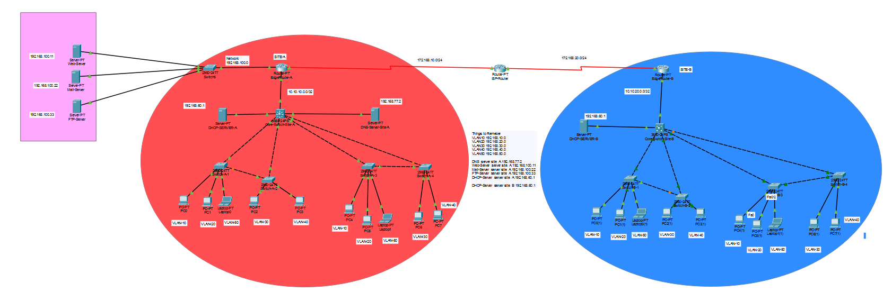

# Computer Networks Final Project

## Overview
This project was developed as part of the Computer Networks course using Cisco Packet Tracer. It demonstrates the design, configuration, and simulation of a computer network with multiple networking services and devices.

## Objectives
- Design a functional network topology.
- Configure routers and switches.
- Implement IP addressing and subnetting.
- Enable communication between different network segments.
- Simulate network services and verify connectivity.

## Technologies Used
- Cisco Packet Tracer
- Cisco Routers
- Cisco Switches
- PCs and End Devices

## Features
- VLAN Configuration
- Inter-VLAN Routing
- Static/Dynamic Routing
- DHCP Configuration
- DNS Service
- Web Server
- Email Server 
- Network Security (ACLs, Port Security, etc.)
- End-to-End Connectivity Testing

## Project Files
- `Final Project.pkt` – Cisco Packet Tracer simulation file.

## Team Members
- Syed Khesham Ali Raza
- Sher Ali Saleem
- Syed Raza Abbas Zaidi

## How to Run
1. Download the repository.
2. Open `Final Project.pkt` using Cisco Packet Tracer.
3. Wait for the topology to load.
4. Test connectivity using ping or simulation mode.

## Project Screenshot

## License
This project was developed as semester project for the subject of "Computer Networking".
